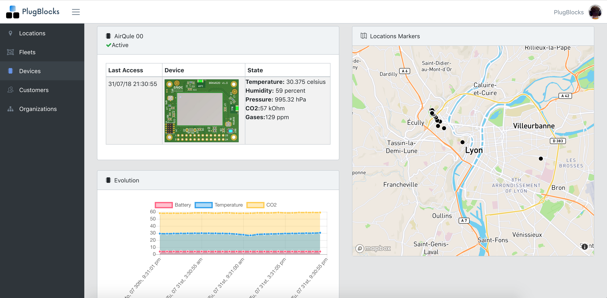

# AirQule, monitor city air pollution at street level in real time
This project is part of Sigfox Sensing the earth universities challenge.

Instructions on how to do this are hence here on [Hackster].(https://www.hackster.io/adriot/airqule-see-city-air-pollution-at-street-level-in-real-time-150c05)

If you find this project interesting, please visit [Plugblocks website](https://plugblocks.com), we are able to help you on your IoT projects, from use case definition, to hardware manufacturing, while providing you our Cloud and firmware expertise.


# Story
## Context

I live in Lyon, France, which is a polluted urban city.

I got the idea to make a geolocated Sigfox powered sensor, that is able to monitor air quality anywhere, at any time.

It allows to build air quality heatmaps at street level, being able to tell where and when the pollution is accurately.

For instance, it is in beta tests in the city, gathering firsts data that helps to understand the pollution, and being able to take actions to reduce it.


## Hardware

I used Wisol 20 RCZ1 module, since it is a Sigfox (for autonomous data uploading), BLE (for smartphone connection), WiFi and GPS (both for geolocation).

I used a BME680 for Temperature, Humidity, Pressure and CO2.

And a Mics-5524 for gases.


## Firmware

The firmware is basically sending position (WiFi SSid's or GPS) and sensors values every 2 minutes if the object is moving (typically fixed on a air pollution mask, while cycling or walking).

It is also advertising in BLE while it is moving.


## Cloud

I used https://plugblocks.com to easily manage and visualize AirQule locations and sensors and users.

In fact, WiFi is preferred over GPS for geolocation since it consumes less power and it is faster to fix.




## BRKWSSFM20R1 Pinout

```
1 				3 			5 			7 		9 		11 			13 		15 			17 			19 		21 		23
Vdd_Wifi_EN 	RX_Wifi 	Vdd_Main 	SCL 	SDA 	VDD_GPS_EN 	VBATT 	SDA_DBG 	SCL_DBG 	AIN1 	AIN0 	VDD_SFX

2 				4 			6 			8 		10 		12 			14 		16 			18 			20 		22 		24
Vdd_Wifi 		TX_Wifi 	V_Bkup_Gps 	GND 	GND 	VDD_GPS 	GND 	2ND_Pow_En 	WKUP 		NRST 	GND 	VDD_SFX_EN
```